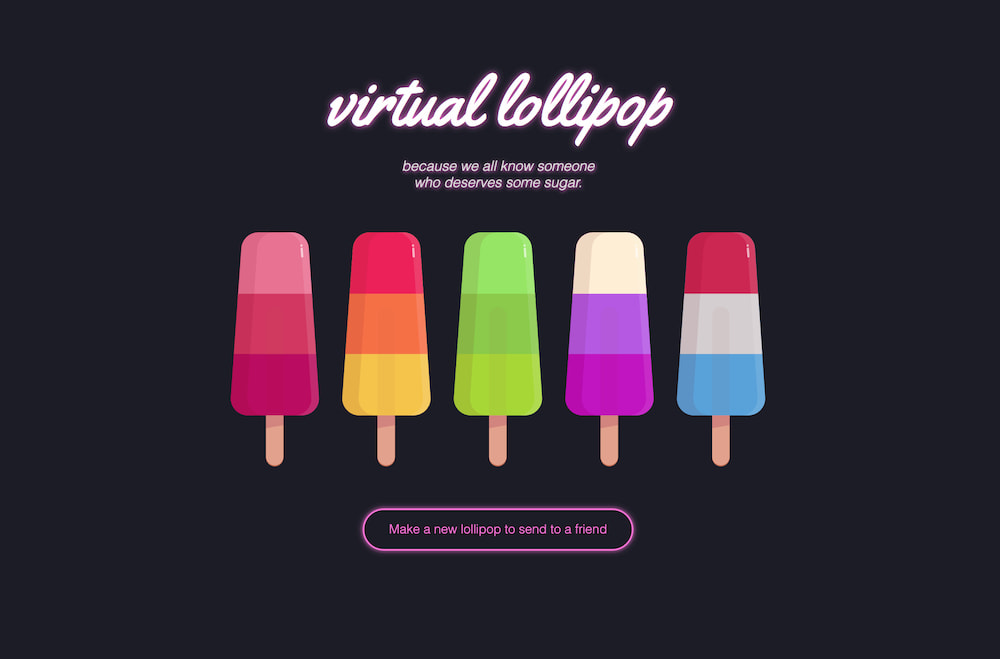

# Virtual Lolly

Making virtual lollipops for you to send to people to pep them up.

(Also a proof of concept site demonstrating a [Jamstack](https://jamstack.org) approach where newly created content is rendered from a content API, while a static render of it is being built into the site for future )

[https://vlolly.net/](https://vlolly.net/lolly/V47YWVlDC)

## Deployed and hosted on Netlify

- User generated data stored by [Fauna DB](https://www.fauna.com) via a serverless function
- Site generate (pre-rendered) by [Eleventy](https://11ty.io)
- Newly created items served via a client-side request to the content API thanks to [Netlify's custom 404 routing](https://www.netlify.com/docs/redirects/?utm_source=github&utm_medium=vlolly-pnh&utm_campaign=devex#custom-404)

## Learn more

There is a more detailed explanation of how this works and what it demonstrates on [CSS-Tricks](https://css-tricks.com/static-first-pre-generated-jamstack-sites-with-serverless-rendering-as-a-fallback/)

👉 https://css-tricks.com/static-first-pre-generated-jamstack-sites-with-serverless-rendering-as-a-fallback/
